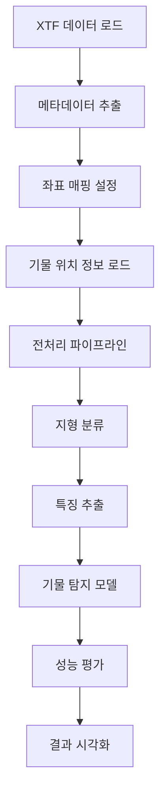

# 사이드스캔 소나 기물 탐지 분석 방법론

## 목차
1. [사이드스캔 소나 기초 개념](#1-사이드스캔-소나-기초-개념)
2. [기물 탐지의 핵심 원리](#2-기물-탐지의-핵심-원리)
3. [데이터 전처리 방법론](#3-데이터-전처리-방법론)
4. [특징 추출 기법](#4-특징-추출-기법)
5. [분석 순서 및 워크플로우](#5-분석-순서-및-워크플로우)
6. [실무 활용 가이드](#6-실무-활용-가이드)

---

## 1. 사이드스캔 소나 기초 개념

### 1.1 사이드스캔 소나란?

사이드스캔 소나(Side-scan Sonar)는 예인체에서 양쪽으로 음향 신호를 발사하여 해저면을 스캔하는 해양 탐사 장비입니다.

#### 작동 원리
```
              수면
               |
    ┌─────────────────┐  예인체 (Towfish)
    │                 │
 ───┴───           ───┴───  음향 빔
Port 채널          Starboard 채널
    │                 │
    ▼                 ▼
═══════════════════════════  해저면
  기물    지형변화    암반
```

#### 핵심 구성 요소
- **예인체(Towfish)**: 음향 신호를 송수신하는 장비
- **Port/Starboard 채널**: 좌우 양방향 스캔 채널
- **Intensity 데이터**: 반사 강도를 나타내는 수치 데이터
- **위치 정보**: GPS/INS 기반 위경도 좌표

### 1.2 데이터 형태 및 특성

#### XTF(eXtended Triton Format) 파일 구조
```python
XTF 파일
├── Header Information
│   ├── 채널 수, 주파수 정보
│   ├── 시간 정보
│   └── 장비 설정값
└── Ping Data (시간 순서)
    ├── Ping #1: [좌표, 시간, Intensity 배열]
    ├── Ping #2: [좌표, 시간, Intensity 배열]
    └── ... (수천~수만 개)
```

#### Intensity 데이터의 물리적 의미
- **높은 값**: 강한 반사 → 단단한 물체, 암반
- **낮은 값**: 약한 반사 → 부드러운 퇴적물, 뻘
- **그림자 영역**: 물체 뒤쪽의 음향 차폐 구역

### 1.3 해저 지형 및 물체의 음향 특성

#### 지형별 반사 패턴
| 지형 유형 | Intensity 특성 | 텍스처 특성 | 기물 탐지 난이도 |
|----------|---------------|------------|-----------------|
| **모래** | 중간 강도 | 균일한 패턴 | 보통 |
| **뻘** | 낮은 강도 | 매끄러운 표면 | 어려움 |
| **암반** | 높은 강도 | 거친 텍스처 | 쉬움 |
| **자갈** | 불규칙한 강도 | 노이즈 패턴 | 어려움 |

#### 기물의 음향 시그니처
```
정상적인 해저면: ~~~~~~~~~~~~~~~~
기물이 있는 경우: ~~~▲~~~[그림자]~~~
                  ↑     ↑
               높은 반사  음향 그림자
```

---

## 2. 기물 탐지의 핵심 원리

### 2.1 기물 탐지의 기본 개념

#### 탐지 가능한 기물 특성
1. **음향 대비**: 주변 해저면과 다른 반사 강도
2. **기하학적 형태**: 자연적이지 않은 규칙적 형상
3. **음향 그림자**: 기물 후방의 그림자 생성
4. **크기**: 소나 해상도로 식별 가능한 최소 크기

#### 탐지 어려움의 요인
- **매몰도**: 퇴적물에 부분적으로 묻힌 경우
- **지형 복잡성**: 복잡한 해저 지형에서의 위장 효과
- **소나 각도**: 입사각에 따른 반사 특성 변화
- **노이즈**: 장비 노이즈 및 환경적 교란

### 2.2 기물 탐지 알고리즘의 기본 전략

#### 접근 방법 1: 임계값 기반 탐지
```python
# 단순 임계값 방법
def simple_threshold_detection(intensity_data, threshold):
    """
    기본적인 임계값 기반 탐지
    """
    candidates = intensity_data > threshold
    return candidates
```

**장점**: 빠른 처리, 단순한 구현
**단점**: 지형 변화에 민감, 많은 오탐

#### 접근 방법 2: 적응형 배경 제거
```python
# 적응형 배경 모델
def adaptive_background_subtraction(data, window_size):
    """
    지역적 배경 모델을 이용한 이상점 탐지
    """
    background = morphological_opening(data, window_size)
    foreground = data - background
    return foreground > adaptive_threshold(foreground)
```

**장점**: 지형 변화에 강건, 적은 오탐
**단점**: 복잡한 매개변수 조정 필요

#### 접근 방법 3: 머신러닝 기반 탐지
```python
# 특징 기반 분류
def feature_based_detection(data):
    """
    다중 특징을 이용한 기계학습 분류
    """
    features = extract_features(data)  # HOG, LBP, Gabor 등
    predictions = trained_model.predict(features)
    return predictions
```

**장점**: 복잡한 패턴 학습 가능, 높은 정확도
**단점**: 대량의 학습 데이터 필요

### 2.3 성능 평가 지표

#### 분류 성능 지표
- **Precision(정밀도)**: TP / (TP + FP)
- **Recall(재현율)**: TP / (TP + FN) 
- **F1-Score**: 2 × (Precision × Recall) / (Precision + Recall)
- **IoU(Intersection over Union)**: 바운딩 박스 정확도

#### 탐지 성능 지표
- **탐지율**: 실제 기물 중 탐지된 비율
- **오탐율**: 탐지된 것 중 오탐의 비율
- **공간적 정확도**: 탐지 위치의 정확성

---

## 3. 데이터 전처리 방법론

### 3.1 워터 컬럼(Water Column) 처리

#### 워터 컬럼이란?
예인체 바로 아래 구역으로, 음향 신호가 직접 해저면에 도달하지 않아 유용한 정보가 없는 영역입니다.

#### 워터 컬럼 처리 방법

**방법 1: 자동 검출 및 제거**
```python
def detect_water_column(data):
    """
    각 ping에서 최소 intensity 영역을 워터컬럼으로 판단
    """
    center_region = data.shape[1] // 2
    search_window = 100  # 중앙 ±50 샘플
    
    water_column_positions = []
    for ping in data:
        center_data = ping[center_region-50:center_region+50]
        min_pos = np.argmin(center_data) + center_region - 50
        water_column_positions.append(min_pos)
    
    return water_column_positions
```

**방법 2: 보간 기반 복원**
```python
def interpolate_water_column(data, wc_mask):
    """
    워터컬럼 영역을 주변값으로 보간
    """
    for i in range(data.shape[0]):
        mask = wc_mask[i, :]
        if np.any(mask):
            # 유효한 데이터 포인트로 선형 보간
            valid_indices = np.where(~mask)[0]
            invalid_indices = np.where(mask)[0]
            
            data[i, invalid_indices] = np.interp(
                invalid_indices, valid_indices, data[i, valid_indices]
            )
    return data
```

### 3.2 강도 정규화(Intensity Normalization)

#### 정규화의 필요성
- 다양한 거리에서의 신호 감쇠 보상
- 장비간 calibration 차이 보정  
- 환경 조건(수심, 수온 등) 영향 제거

#### 정규화 방법

**Min-Max 정규화**
```python
def minmax_normalize(data, target_range=(0, 1)):
    """
    [0, 1] 또는 지정 범위로 정규화
    """
    data_min, data_max = np.min(data), np.max(data)
    normalized = (data - data_min) / (data_max - data_min)
    
    if target_range != (0, 1):
        min_target, max_target = target_range
        normalized = normalized * (max_target - min_target) + min_target
        
    return normalized
```

**적응형 히스토그램 평활화 (CLAHE)**
```python
def clahe_normalize(data, clip_limit=2.0, tile_size=(8, 8)):
    """
    대비 제한 적응형 히스토그램 평활화
    """
    # 0-255 범위로 변환
    data_uint8 = (data * 255).astype(np.uint8)
    
    # CLAHE 적용
    clahe = cv2.createCLAHE(
        clipLimit=clip_limit, 
        tileGridSize=tile_size
    )
    enhanced = clahe.apply(data_uint8)
    
    return enhanced.astype(np.float32) / 255.0
```

### 3.3 노이즈 제거

#### 노이즈 유형
1. **장비 노이즈**: 전자적 간섭
2. **환경 노이즈**: 기포, 생물체 등
3. **다중 경로**: 반사 신호 간섭
4. **임펄스 노이즈**: 순간적 강한 신호

#### 노이즈 제거 기법

**가우시안 필터**
```python
def gaussian_denoising(data, sigma=1.0):
    """
    가우시안 필터로 고주파 노이즈 제거
    """
    return ndimage.gaussian_filter(data, sigma=sigma)
```

**양방향 필터 (Bilateral Filter)**
```python
def bilateral_denoising(data, d=9, sigma_color=75, sigma_space=75):
    """
    엣지 보존하면서 노이즈 제거
    """
    data_uint8 = (data * 255).astype(np.uint8)
    filtered = cv2.bilateralFilter(data_uint8, d, sigma_color, sigma_space)
    return filtered.astype(np.float32) / 255.0
```

**Total Variation 디노이징**
```python
def tv_denoising(data, weight=0.1):
    """
    Total Variation 정규화 기반 노이즈 제거
    """
    return restoration.denoise_tv_chambolle(data, weight=weight)
```

### 3.4 지형 분류 및 적응형 처리

#### 지형 분류 알고리즘
```python
def classify_terrain(data, window_size=32):
    """
    텍스처 특성 기반 지형 분류
    """
    # 텍스처 특성 계산
    variance_map = ndimage.generic_filter(data, np.var, size=window_size)
    entropy_map = ndimage.generic_filter(data, entropy, size=window_size)
    contrast_map = ndimage.generic_filter(data, np.std, size=window_size)
    
    # 분류 규칙
    terrain_map = np.zeros_like(data, dtype=int)
    
    # 모래: 중간 분산, 낮은 엔트로피
    sand_mask = ((variance_map > np.percentile(variance_map, 25)) & 
                 (variance_map < np.percentile(variance_map, 75)) &
                 (entropy_map < np.percentile(entropy_map, 50)))
    terrain_map[sand_mask] = 1  # SAND
    
    # 뻘: 낮은 분산, 낮은 대비
    mud_mask = ((variance_map < np.percentile(variance_map, 25)) &
                (contrast_map < np.percentile(contrast_map, 30)))
    terrain_map[mud_mask] = 2  # MUD
    
    # 암반: 높은 분산, 높은 대비
    rock_mask = ((variance_map > np.percentile(variance_map, 75)) &
                 (contrast_map > np.percentile(contrast_map, 70)))
    terrain_map[rock_mask] = 3  # ROCK
    
    return terrain_map
```

#### 지형별 적응형 처리
```python
def terrain_adaptive_processing(data, terrain_map):
    """
    지형 유형에 따른 차별적 처리
    """
    processed_data = data.copy()
    
    # 모래 지역: 추가 스무딩
    sand_mask = terrain_map == 1
    processed_data[sand_mask] = gaussian_filter(
        processed_data[sand_mask], sigma=0.5
    )
    
    # 뻘 지역: 대비 향상
    mud_mask = terrain_map == 2
    mud_data = processed_data[mud_mask]
    processed_data[mud_mask] = exposure.adjust_gamma(mud_data, gamma=0.8)
    
    # 암반 지역: 엣지 보존 필터
    rock_mask = terrain_map == 3
    if np.any(rock_mask):
        rock_region = processed_data * rock_mask.astype(float)
        processed_data = np.where(
            rock_mask, 
            bilateral_filter(rock_region),
            processed_data
        )
    
    return processed_data
```

---

## 4. 특징 추출 기법

### 4.1 Histogram of Oriented Gradients (HOG)

#### HOG의 원리
HOG는 이미지의 gradient 방향 분포를 이용해 물체의 형태를 표현하는 특징 추출 기법입니다.

#### HOG 계산 과정
```python
def extract_hog_features(image, orientations=9, pixels_per_cell=(8, 8)):
    """
    HOG 특징 추출
    
    1단계: Gradient 계산
    2단계: Orientation bins 생성  
    3단계: Cell 단위 히스토그램 계산
    4단계: Block 정규화
    """
    from skimage.feature import hog
    
    features = hog(
        image,
        orientations=orientations,
        pixels_per_cell=pixels_per_cell,
        cells_per_block=(2, 2),
        visualize=False,
        feature_vector=True
    )
    
    return features
```

#### 기물 탐지에서의 HOG 활용
- **강점**: 물체의 윤곽선과 모양을 효과적으로 포착
- **적용**: 기물의 기하학적 형태 인식
- **한계**: 텍스처 정보 부족

### 4.2 Local Binary Pattern (LBP)

#### LBP의 원리
중심 픽셀 값과 주변 픽셀 값을 비교하여 지역적 텍스처를 인코딩합니다.

#### LBP 계산 방법
```python
def extract_lbp_features(image, radius=1, n_points=8):
    """
    LBP 특징 추출
    
    각 픽셀에서:
    1. 중심값과 주변 8개 픽셀 비교
    2. 큰 값은 1, 작은 값은 0으로 이진화
    3. 8비트 패턴을 10진수로 변환
    """
    from skimage.feature import local_binary_pattern
    
    lbp = local_binary_pattern(image, n_points, radius, method='uniform')
    
    # 히스토그램 특징 추출
    hist, _ = np.histogram(lbp.ravel(), bins=n_points + 2, 
                          range=(0, n_points + 2))
    hist = hist.astype(float)
    hist /= (hist.sum() + 1e-7)  # 정규화
    
    return hist
```

#### LBP 활용 예시
```python
def analyze_texture_with_lbp(image, window_size=64):
    """
    윈도우 단위로 LBP 텍스처 분석
    """
    h, w = image.shape
    lbp_features = []
    
    for i in range(0, h-window_size, window_size//2):
        for j in range(0, w-window_size, window_size//2):
            window = image[i:i+window_size, j:j+window_size]
            lbp_hist = extract_lbp_features(window)
            lbp_features.append(lbp_hist)
    
    return np.array(lbp_features)
```

### 4.3 Gabor Filter

#### Gabor 필터의 원리
특정 방향과 주파수의 패턴을 검출하는 대역통과 필터입니다.

#### Gabor 필터 구현
```python
def gabor_filter_bank(image, frequencies=[0.05, 0.1, 0.2], 
                      orientations=[0, 45, 90, 135]):
    """
    다중 주파수/방향 Gabor 필터 뱅크
    """
    from skimage.filters import gabor
    
    responses = []
    
    for freq in frequencies:
        for angle in orientations:
            # Gabor 필터 적용
            filtered_real, filtered_imag = gabor(
                image, frequency=freq, theta=np.deg2rad(angle)
            )
            
            # 크기 응답 계산
            magnitude = np.sqrt(filtered_real**2 + filtered_imag**2)
            responses.append(magnitude)
    
    return np.array(responses)

def extract_gabor_features(image):
    """
    Gabor 응답에서 통계적 특징 추출
    """
    gabor_responses = gabor_filter_bank(image)
    
    features = []
    for response in gabor_responses:
        # 각 Gabor 응답의 통계적 특징
        features.extend([
            np.mean(response),      # 평균
            np.std(response),       # 표준편차
            np.max(response),       # 최댓값
            np.percentile(response, 75)  # 75 백분위수
        ])
    
    return np.array(features)
```

### 4.4 Shape from Shading (SfS)

#### SfS의 개념
2D 이미지의 shading 정보로부터 3D 형상을 복원하는 기법입니다.

#### 사이드스캔 소나에서의 SfS 적용
```python
def estimate_height_from_intensity(intensity_data, light_direction=(1, 0)):
    """
    강도 데이터로부터 상대적 높이 추정
    """
    # Gradient 계산
    gy, gx = np.gradient(intensity_data)
    
    # 법선 벡터 추정 (간단한 가정)
    # I = max(0, n · l) 여기서 I: intensity, n: normal, l: light
    
    # 높이 맵 초기화
    height_map = np.zeros_like(intensity_data)
    
    # 반복적 높이 복원 (단순화된 버전)
    for iteration in range(10):
        # 현재 높이에서 예상되는 강도 계산
        predicted_gy, predicted_gx = np.gradient(height_map)
        normal_x = -predicted_gx
        normal_y = -predicted_gy
        normal_z = np.ones_like(predicted_gx)
        
        # 정규화
        norm = np.sqrt(normal_x**2 + normal_y**2 + normal_z**2)
        normal_x /= norm
        normal_y /= norm  
        normal_z /= norm
        
        # 조명 방향과 내적
        predicted_intensity = np.maximum(0, 
            normal_x * light_direction[0] + 
            normal_y * light_direction[1] + 
            normal_z * 0.5  # 임의의 z 방향 조명
        )
        
        # 오차 계산 및 높이 업데이트
        error = intensity_data - predicted_intensity
        height_map += 0.1 * error  # 학습률 0.1
    
    return height_map

def extract_sfs_features(intensity_data):
    """
    SfS에서 추출한 높이 정보의 특징
    """
    height_map = estimate_height_from_intensity(intensity_data)
    
    features = {
        'max_height': np.max(height_map),
        'height_variance': np.var(height_map),
        'height_skewness': scipy.stats.skew(height_map.flatten()),
        'height_gradient_magnitude': np.mean(np.gradient(height_map)[0]**2 + 
                                           np.gradient(height_map)[1]**2)
    }
    
    return features
```

### 4.5 복합 특징 추출

#### 다중 특징 결합
```python
class MultiFeatureExtractor:
    """
    다중 특징 추출 및 결합 클래스
    """
    
    def __init__(self):
        self.feature_extractors = {
            'hog': self.extract_hog,
            'lbp': self.extract_lbp,
            'gabor': self.extract_gabor,
            'sfs': self.extract_sfs,
            'statistical': self.extract_statistical
        }
    
    def extract_all_features(self, image_patch):
        """
        모든 특징 추출 및 결합
        """
        features = {}
        
        for name, extractor in self.feature_extractors.items():
            try:
                features[name] = extractor(image_patch)
            except Exception as e:
                print(f"특징 추출 실패 ({name}): {e}")
                features[name] = None
        
        # 유효한 특징들만 결합
        valid_features = [f for f in features.values() if f is not None]
        
        if valid_features:
            combined_features = np.concatenate(valid_features)
        else:
            combined_features = np.array([])
        
        return combined_features, features
    
    def extract_statistical(self, image):
        """
        기본 통계적 특징
        """
        return np.array([
            np.mean(image),
            np.std(image), 
            np.min(image),
            np.max(image),
            np.median(image),
            scipy.stats.skew(image.flatten()),
            scipy.stats.kurtosis(image.flatten())
        ])
```

---

## 5. 분석 순서 및 워크플로우

### 5.1 전체 분석 프로세스



### 5.2 단계별 상세 워크플로우

#### Phase 1: 데이터 준비 및 검증
```python
def phase1_data_preparation(xtf_file, location_file):
    """
    1단계: 데이터 로드 및 기본 검증
    """
    print("=== Phase 1: 데이터 준비 ===")
    
    # 1.1 XTF 파일 로드
    reader = XTFReader(xtf_file)
    success = reader.load_file()
    if not success:
        raise ValueError("XTF 파일 로드 실패")
    
    # 1.2 Ping 데이터 파싱
    ping_data = reader.parse_pings()
    print(f"총 {len(ping_data)} ping 로드됨")
    
    # 1.3 기본 품질 검증
    intensity_matrix = reader.extract_intensity_matrix(channel=0)
    quality_metrics = validate_data_quality(intensity_matrix)
    
    print(f"데이터 품질:")
    print(f"  - 동적 범위: {quality_metrics['dynamic_range']:.2f}")
    print(f"  - SNR: {quality_metrics['snr']:.2f} dB")
    print(f"  - 결측치: {quality_metrics['missing_ratio']:.1%}")
    
    # 1.4 좌표 정보 검증
    geo_df = reader.get_georeferenced_data()
    coord_bounds = {
        'lat': (geo_df['latitude'].min(), geo_df['latitude'].max()),
        'lon': (geo_df['longitude'].min(), geo_df['longitude'].max())
    }
    print(f"좌표 범위: {coord_bounds}")
    
    return reader, ping_data, intensity_matrix, geo_df

def validate_data_quality(intensity_data):
    """
    데이터 품질 검증
    """
    metrics = {
        'dynamic_range': np.max(intensity_data) - np.min(intensity_data),
        'snr': calculate_snr(intensity_data),
        'missing_ratio': np.sum(intensity_data == 0) / intensity_data.size
    }
    return metrics
```

#### Phase 2: 전처리 및 좌표 매핑
```python
def phase2_preprocessing(intensity_data, geo_df, location_file):
    """
    2단계: 전처리 및 좌표 매핑
    """
    print("=== Phase 2: 전처리 ===")
    
    # 2.1 전처리 설정
    config = PreprocessingConfig(
        remove_water_column=True,
        normalize_intensity=True,
        apply_denoising=True,
        enhance_contrast=True,
        terrain_adaptive=True
    )
    
    # 2.2 전처리 실행
    preprocessor = Preprocessor(config)
    result = preprocessor.process(intensity_data)
    
    print(f"전처리 단계: {result.processing_steps}")
    print(f"품질 개선:")
    print(f"  - SNR: {result.quality_metrics['snr']:.2f} dB")
    print(f"  - 대비 향상: {result.quality_metrics['contrast_improvement']:.2f}x")
    
    # 2.3 좌표 매핑 설정
    transformer = CoordinateTransformer(utm_zone=52)
    mapper = CoordinateMapper(transformer)
    mapper.set_sonar_data(geo_df, intensity_data.shape)
    
    # 2.4 기물 위치 로드
    target_loader = TargetLocationLoader(transformer)
    target_loader.load_from_excel(location_file)
    
    return result, mapper, target_loader

```

#### Phase 3: 특징 추출 및 분석
```python
def phase3_feature_extraction(processed_data, mapper, targets):
    """
    3단계: 특징 추출
    """
    print("=== Phase 3: 특징 추출 ===")
    
    # 3.1 관심 영역 추출
    patches = extract_target_patches(processed_data, mapper, targets)
    background_patches = extract_background_patches(processed_data, mapper)
    
    print(f"추출된 패치: 기물 {len(patches)}, 배경 {len(background_patches)}")
    
    # 3.2 특징 추출
    extractor = MultiFeatureExtractor()
    
    target_features = []
    for patch in patches:
        features, _ = extractor.extract_all_features(patch)
        target_features.append(features)
    
    background_features = []
    for patch in background_patches:
        features, _ = extractor.extract_all_features(patch)
        background_features.append(features)
    
    # 3.3 특징 분석
    analyze_feature_separability(target_features, background_features)
    
    return target_features, background_features

def analyze_feature_separability(target_features, bg_features):
    """
    특징의 분리 가능성 분석
    """
    from sklearn.metrics import silhouette_score
    
    X = np.vstack([target_features, bg_features])
    labels = np.hstack([
        np.ones(len(target_features)),
        np.zeros(len(bg_features))
    ])
    
    # 실루엣 스코어 계산
    silhouette = silhouette_score(X, labels)
    print(f"특징 분리도 (Silhouette Score): {silhouette:.3f}")
    
    # 차원별 중요도 분석
    if X.shape[1] > 0:
        feature_importance = []
        for i in range(X.shape[1]):
            target_mean = np.mean([f[i] for f in target_features])
            bg_mean = np.mean([f[i] for f in bg_features])
            target_std = np.std([f[i] for f in target_features])
            bg_std = np.std([f[i] for f in bg_features])
            
            # Fisher's ratio (클래스 간 거리 / 클래스 내 분산)
            fisher_ratio = abs(target_mean - bg_mean) / (target_std + bg_std + 1e-8)
            feature_importance.append(fisher_ratio)
        
        # 상위 중요 특징 출력
        top_indices = np.argsort(feature_importance)[-5:]
        print("상위 중요 특징:")
        for i in top_indices:
            print(f"  특징 {i}: {feature_importance[i]:.3f}")
```

#### Phase 4: 모델 학습 및 평가
```python
def phase4_model_training(target_features, bg_features):
    """
    4단계: 모델 학습 및 평가
    """
    print("=== Phase 4: 모델 학습 ===")
    
    # 4.1 데이터 준비
    X = np.vstack([target_features, bg_features])
    y = np.hstack([
        np.ones(len(target_features)),
        np.zeros(len(bg_features))
    ])
    
    # 4.2 데이터 분할
    from sklearn.model_selection import train_test_split
    X_train, X_test, y_train, y_test = train_test_split(
        X, y, test_size=0.2, random_state=42, stratify=y
    )
    
    # 4.3 여러 모델 비교
    models = {
        'SVM': SVC(kernel='rbf', probability=True),
        'Random Forest': RandomForestClassifier(n_estimators=100),
        'Gradient Boosting': GradientBoostingClassifier(),
        'Neural Network': MLPClassifier(hidden_layer_sizes=(100, 50))
    }
    
    results = {}
    for name, model in models.items():
        # 학습
        model.fit(X_train, y_train)
        
        # 예측
        y_pred = model.predict(X_test)
        y_prob = model.predict_proba(X_test)[:, 1]
        
        # 평가
        precision = precision_score(y_test, y_pred)
        recall = recall_score(y_test, y_pred)
        f1 = f1_score(y_test, y_pred)
        auc = roc_auc_score(y_test, y_prob)
        
        results[name] = {
            'model': model,
            'precision': precision,
            'recall': recall,
            'f1': f1,
            'auc': auc
        }
        
        print(f"{name}:")
        print(f"  Precision: {precision:.3f}")
        print(f"  Recall: {recall:.3f}")
        print(f"  F1-Score: {f1:.3f}")
        print(f"  AUC: {auc:.3f}")
    
    # 최고 성능 모델 선택
    best_model_name = max(results.keys(), key=lambda k: results[k]['f1'])
    best_model = results[best_model_name]['model']
    
    print(f"\n최고 성능 모델: {best_model_name}")
    
    return best_model, results
```

### 5.3 분석 결과 해석 가이드

#### 성능 지표 해석
```python
def interpret_results(results):
    """
    결과 해석 및 권장사항
    """
    print("=== 결과 해석 ===")
    
    for model_name, metrics in results.items():
        print(f"\n{model_name} 성능 분석:")
        
        precision = metrics['precision']
        recall = metrics['recall']
        f1 = metrics['f1']
        
        # 성능 해석
        if precision > 0.9:
            print("  - 매우 높은 정밀도: 오탐이 적음")
        elif precision > 0.7:
            print("  - 양호한 정밀도: 실용적 수준")
        else:
            print("  - 낮은 정밀도: 오탐 많음, 튜닝 필요")
        
        if recall > 0.9:
            print("  - 매우 높은 재현율: 기물 놓침이 적음")
        elif recall > 0.7:
            print("  - 양호한 재현율: 실용적 수준")
        else:
            print("  - 낮은 재현율: 기물 많이 놓침")
        
        # 균형성 평가
        balance = min(precision, recall) / max(precision, recall)
        if balance > 0.8:
            print("  - 균형잡힌 성능")
        else:
            print("  - 불균형한 성능: 임계값 조정 필요")
```

---

## 6. 실무 활용 가이드

### 6.1 프로젝트 설정 및 실행

#### 환경 설정
```bash
# 1. Python 환경 설정 (3.8 이상)
python -m venv sidescan_env
source sidescan_env/bin/activate  # Linux/Mac
# sidescan_env\Scripts\activate  # Windows

# 2. 필수 패키지 설치
pip install -r requirements.txt

# 3. 추가 패키지 (필요시)
pip install pyxtf>=1.4.0  # XTF 파일 처리
```

#### 빠른 시작 가이드
```bash
# 인터랙티브 모드로 시작
python main.py --mode interactive

# 샘플 데이터 분석
python main.py --mode sample

# 배치 데이터 처리
python main.py --mode batch --log-level DEBUG
```

### 6.2 데이터 준비 체크리스트

#### 입력 데이터 요구사항
- [ ] **XTF 파일**: 사이드스캔 소나 raw 데이터
  - 파일 크기: 수십 MB ~ 수 GB
  - 필수 메타데이터: 위치, 시간, 주파수
  - 권장 ping 수: 1000개 이상

- [ ] **위치 정보 파일**: Excel 또는 CSV 형태
  - 필수 컬럼: 위도(latitude), 경도(longitude)
  - 선택 컬럼: 기물ID, 설명
  - 좌표계: WGS84 (EPSG:4326)

- [ ] **보조 데이터** (선택사항):
  - BMP/PNG 이미지 파일 (시각적 참조용)
  - 해도 정보
  - 환경 데이터 (수심, 조류 등)

#### 데이터 품질 확인
```python
def check_data_quality(xtf_file, location_file):
    """
    데이터 품질 자동 체크
    """
    issues = []
    
    # XTF 파일 체크
    try:
        reader = XTFReader(xtf_file)
        reader.load_file()
        summary = reader.get_summary()
        
        if summary['total_pings'] < 100:
            issues.append("경고: Ping 수가 적음 (< 100)")
        
        if not summary['coordinate_bounds']['lat'][0]:
            issues.append("오류: 위치 정보 없음")
            
    except Exception as e:
        issues.append(f"XTF 로드 실패: {e}")
    
    # 위치 파일 체크
    try:
        df = pd.read_excel(location_file)
        required_cols = ['latitude', 'longitude']
        missing_cols = [col for col in required_cols if col not in df.columns]
        
        if missing_cols:
            issues.append(f"위치 파일 컬럼 누락: {missing_cols}")
            
        # 좌표 범위 체크
        if df['latitude'].min() < -90 or df['latitude'].max() > 90:
            issues.append("위도 값이 유효 범위를 벗어남")
        if df['longitude'].min() < -180 or df['longitude'].max() > 180:
            issues.append("경도 값이 유효 범위를 벗어남")
            
    except Exception as e:
        issues.append(f"위치 파일 로드 실패: {e}")
    
    return issues
```

### 6.3 매개변수 튜닝 가이드

#### 전처리 매개변수
```python
# 지형별 권장 설정
TERRAIN_CONFIGS = {
    'sand_dominant': PreprocessingConfig(
        water_column_width=40,
        normalization_method='minmax',
        denoising_method='gaussian',
        contrast_method='clahe'
    ),
    
    'mud_dominant': PreprocessingConfig(
        water_column_width=60,
        normalization_method='histogram',
        denoising_method='bilateral',
        contrast_method='adaptive'
    ),
    
    'rock_dominant': PreprocessingConfig(
        water_column_width=30,
        normalization_method='zscore',
        denoising_method='tv',
        contrast_method='clahe'
    ),
    
    'mixed_terrain': PreprocessingConfig(
        water_column_width=50,
        normalization_method='minmax',
        denoising_method='bilateral',
        contrast_method='clahe',
        terrain_adaptive=True
    )
}
```

#### 매개변수 자동 최적화
```python
def optimize_parameters(data, targets, param_ranges):
    """
    Grid Search를 이용한 매개변수 최적화
    """
    from sklearn.model_selection import GridSearchCV
    from sklearn.pipeline import Pipeline
    
    # 파이프라인 구성
    pipeline = Pipeline([
        ('preprocessing', CustomPreprocessor()),
        ('feature_extraction', MultiFeatureExtractor()),
        ('classifier', SVC(probability=True))
    ])
    
    # 매개변수 그리드
    param_grid = {
        'preprocessing__water_column_width': [30, 50, 70],
        'preprocessing__normalization_method': ['minmax', 'histogram'],
        'classifier__C': [0.1, 1, 10],
        'classifier__gamma': ['scale', 0.001, 0.01]
    }
    
    # Grid Search 실행
    grid_search = GridSearchCV(
        pipeline, param_grid, 
        cv=5, scoring='f1', 
        n_jobs=-1, verbose=1
    )
    
    grid_search.fit(data, targets)
    
    print(f"최적 매개변수: {grid_search.best_params_}")
    print(f"최고 성능: {grid_search.best_score_:.3f}")
    
    return grid_search.best_estimator_
```

### 6.4 성능 향상 팁

#### 데이터 품질 개선
```python
def improve_data_quality(data):
    """
    데이터 품질 개선 기법
    """
    improved_data = data.copy()
    
    # 1. 이상치 제거
    q1, q3 = np.percentile(improved_data, [25, 75])
    iqr = q3 - q1
    lower_bound = q1 - 1.5 * iqr
    upper_bound = q3 + 1.5 * iqr
    
    improved_data = np.clip(improved_data, lower_bound, upper_bound)
    
    # 2. 적응형 대비 향상
    improved_data = adaptive_contrast_enhancement(improved_data)
    
    # 3. 구조적 노이즈 제거
    improved_data = remove_structural_noise(improved_data)
    
    return improved_data

def adaptive_contrast_enhancement(data):
    """
    지역적 적응형 대비 향상
    """
    # 지역 평균과 분산 계산
    local_mean = ndimage.uniform_filter(data, size=21)
    local_variance = ndimage.uniform_filter(data**2, size=21) - local_mean**2
    
    # 적응형 이득 계산
    global_variance = np.var(data)
    enhancement_factor = np.sqrt(global_variance / (local_variance + 1e-8))
    enhancement_factor = np.clip(enhancement_factor, 0.5, 2.0)
    
    # 향상 적용
    enhanced = local_mean + enhancement_factor * (data - local_mean)
    
    return enhanced
```

#### 계산 성능 최적화
```python
def optimize_performance():
    """
    성능 최적화 가이드
    """
    tips = {
        'memory_optimization': [
            "배치 크기 조정: max_pings_per_load=500",
            "데이터 타입 최적화: float32 사용", 
            "불필요한 중간 결과 제거",
            "메모리 맵핑 파일 사용"
        ],
        
        'cpu_optimization': [
            "NumPy 벡터화 연산 활용",
            "병렬 처리: joblib 또는 multiprocessing",
            "컴파일된 함수: numba JIT",
            "효율적인 알고리즘 선택"
        ],
        
        'io_optimization': [
            "SSD 사용 권장",
            "파일 압축 고려",
            "캐싱 활용",
            "스트리밍 처리"
        ]
    }
    
    return tips

# 병렬 처리 예시
def parallel_feature_extraction(patches, n_jobs=-1):
    """
    병렬 특징 추출
    """
    from joblib import Parallel, delayed
    
    def extract_single_patch(patch):
        extractor = MultiFeatureExtractor()
        return extractor.extract_all_features(patch)
    
    results = Parallel(n_jobs=n_jobs)(
        delayed(extract_single_patch)(patch) 
        for patch in patches
    )
    
    return results
```

### 6.5 문제 해결 가이드

#### 자주 발생하는 문제들

**1. XTF 파일 로드 실패**
```python
def troubleshoot_xtf_loading(xtf_file):
    """
    XTF 로딩 문제 진단
    """
    issues = []
    
    # 파일 존재 확인
    if not Path(xtf_file).exists():
        issues.append("파일이 존재하지 않음")
        return issues
    
    # 파일 크기 확인
    file_size = Path(xtf_file).stat().st_size
    if file_size < 1024:  # 1KB 미만
        issues.append("파일이 너무 작음 (손상 가능성)")
    
    # pyxtf 라이브러리 버전 확인
    try:
        import pyxtf
        print(f"pyxtf 버전: {pyxtf.__version__}")
    except ImportError:
        issues.append("pyxtf 라이브러리 설치 필요: pip install pyxtf")
    
    # 파일 형식 확인
    try:
        with open(xtf_file, 'rb') as f:
            header = f.read(10)
            if not header.startswith(b'XTF'):
                issues.append("유효한 XTF 파일이 아님")
    except:
        issues.append("파일 읽기 권한 없음")
    
    return issues
```

**2. 메모리 부족 문제**
```python
def handle_memory_issues(xtf_file):
    """
    메모리 부족 시 대응 방법
    """
    print("메모리 최적화 모드 활성화")
    
    # 배치 크기 줄이기
    reader = XTFReader(xtf_file, max_pings=200)  # 기본값보다 작게
    
    # 채널별 순차 처리
    channels = [0, 1]  # Port, Starboard
    results = {}
    
    for channel in channels:
        print(f"채널 {channel} 처리 중...")
        intensity, geo_data = reader.get_channel_data(channel)
        
        # 즉시 처리하여 메모리 확보
        processed_result = process_single_channel(intensity)
        results[channel] = processed_result
        
        # 메모리 정리
        del intensity, geo_data
        import gc; gc.collect()
    
    return results
```

**3. 좌표 매핑 오류**
```python
def debug_coordinate_mapping(geo_df, targets):
    """
    좌표 매핑 문제 디버깅
    """
    print("좌표 매핑 진단...")
    
    # 좌표계 확인
    print(f"소나 데이터 좌표 범위:")
    print(f"  위도: {geo_df['latitude'].min():.6f} ~ {geo_df['latitude'].max():.6f}")
    print(f"  경도: {geo_df['longitude'].min():.6f} ~ {geo_df['longitude'].max():.6f}")
    
    print(f"기물 위치 좌표 범위:")
    print(f"  위도: {targets['latitude'].min():.6f} ~ {targets['latitude'].max():.6f}")
    print(f"  경도: {targets['longitude'].min():.6f} ~ {targets['longitude'].max():.6f}")
    
    # 겹침 확인
    overlap_lat = (
        max(geo_df['latitude'].min(), targets['latitude'].min()),
        min(geo_df['latitude'].max(), targets['latitude'].max())
    )
    overlap_lon = (
        max(geo_df['longitude'].min(), targets['longitude'].min()),
        min(geo_df['longitude'].max(), targets['longitude'].max())
    )
    
    if overlap_lat[0] > overlap_lat[1] or overlap_lon[0] > overlap_lon[1]:
        print("경고: 소나 데이터와 기물 위치가 겹치지 않음")
    else:
        print(f"겹치는 영역: 위도 {overlap_lat}, 경도 {overlap_lon}")
    
    # UTM 변환 확인
    transformer = CoordinateTransformer(utm_zone=52)
    sample_coords = geo_df.iloc[0]
    utm_x, utm_y = transformer.wgs84_to_utm_coords(
        sample_coords['longitude'], 
        sample_coords['latitude']
    )
    print(f"UTM 변환 예시: ({sample_coords['longitude']:.6f}, {sample_coords['latitude']:.6f}) -> ({utm_x:.1f}, {utm_y:.1f})")
```

### 6.6 결과 검증 및 품질 관리

#### 결과 검증 체크리스트
```python
def validate_results(detection_results, ground_truth):
    """
    결과 검증 및 품질 관리
    """
    validation_report = {}
    
    # 1. 탐지 성능 검증
    performance_metrics = calculate_detection_metrics(
        detection_results, ground_truth
    )
    validation_report['performance'] = performance_metrics
    
    # 2. 공간적 정확도 검증
    spatial_accuracy = calculate_spatial_accuracy(
        detection_results, ground_truth
    )
    validation_report['spatial_accuracy'] = spatial_accuracy
    
    # 3. 신뢰도 분석
    confidence_analysis = analyze_detection_confidence(detection_results)
    validation_report['confidence'] = confidence_analysis
    
    # 4. 오탐/미탐 분석
    error_analysis = analyze_detection_errors(
        detection_results, ground_truth
    )
    validation_report['errors'] = error_analysis
    
    # 5. 품질 등급 할당
    overall_grade = assign_quality_grade(validation_report)
    validation_report['overall_grade'] = overall_grade
    
    return validation_report

def assign_quality_grade(validation_report):
    """
    전체적인 품질 등급 할당
    """
    perf = validation_report['performance']
    
    if perf['f1_score'] >= 0.9 and perf['precision'] >= 0.85:
        return 'A (우수)'
    elif perf['f1_score'] >= 0.8 and perf['precision'] >= 0.75:
        return 'B (양호)'
    elif perf['f1_score'] >= 0.7 and perf['precision'] >= 0.65:
        return 'C (보통)'
    else:
        return 'D (개선 필요)'
```

이 분석 방법론 문서는 사이드스캔 소나 데이터를 이용한 기물 탐지의 전반적인 이론적 배경부터 실무적인 구현 방법까지를 포괄적으로 다루고 있습니다. 각 단계별로 구체적인 코드 예시와 함께 실제 적용 시 고려해야 할 사항들을 상세히 설명하였습니다.